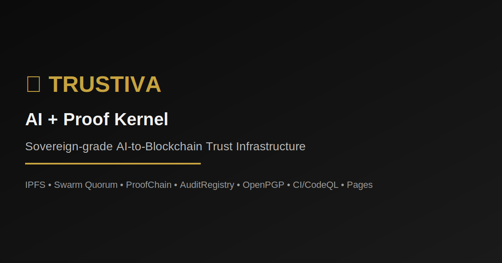

<div align="center">

# ⚜ Trustiva AI + Proof Kernel

Secure, autonomous AI‑to‑blockchain pipeline that publishes, verifies, and anchors artifacts to IPFS and on‑chain registries.

[](https://github.com/Trustiva7777/Trustiva-Ai-/actions/workflows/ci.yml)
[](./LICENSE)


[](https://github.com/Trustiva7777/Trustiva-Ai-)
[](https://github.com/Trustiva7777/Trustiva-Ai-/issues)
[](https://github.com/Trustiva7777/Trustiva-Ai-/pulls)

<sub style="color:#888">Theme: Trustiva Classic — black with gold accents (#C7A340).</sub>

</div>

## 🌟 Mission

Deliver a production‑grade trust pipeline where AI‑generated evidence is:

- Published to IPFS with gateway verification
- Validated by an AI swarm quorum and Ops API
- Finalized on a ProofChain and registered in an AuditRegistry smart contract
<div align="center">

# ⚜ Trustiva AI + Proof Kernel

Autonomous AI‑to‑blockchain trust infrastructure.



[](https://github.com/Trustiva7777/Trustiva-Ai-/actions/workflows/ci.yml)
[](./LICENSE)
[](https://github.com/Trustiva7777/Trustiva-Ai-/releases)
[](./.github/workflows/codeql.yml)
[](./docs)
[](https://trustiva7777.github.io/Trustiva-Ai-/)


[](https://github.com/Trustiva7777/Trustiva-Ai-)
[](https://github.com/Trustiva7777/Trustiva-Ai-/issues)
[](https://github.com/Trustiva7777/Trustiva-Ai-/pulls)
[](#)

<sub style="color:#888">Theme: Trustiva Classic — black with gold accents (#C7A340).</sub>

</div>
    IPFS[(IPFS\nPublish + Gateway Verify)]
## Table of Contents

1. Overview
2. Mission & Philosophy
3. Architecture Overview
4. Core Features
5. Stack & Technologies
6. System Workflow
7. Smart Contracts
8. AI Swarm & Orchestration
9. Ops API
10. Web Verification UI
11. Compliance & Jurisdictions
12. Installation & Quick Start
13. Local Development
14. Running Tests
15. Environment Variables
16. Docker & Deployment
17. Continuous Integration (CI)
18. Security & Key Management
19. Governance & Extensions
20. Roadmap & Future Milestones
21. Contributing
22. Credits & Authors
23. License

---

## 1) Overview

Trustiva AI + Proof Kernel is a sovereign‑grade audit engine that fuses AI‑generated intelligence with blockchain verification. It provides a reproducible, cryptographically verifiable trust loop — from data creation, to AI validation, to immutable proof anchoring.

---

## 2) Mission & Philosophy
    QDR[Qdrant]
    RDS[(Redis Streams)]
  end

  subgraph Chain
    POI[ProofChain.sol\nFinalize(root)]
    REG[AuditRegistry.sol\nRegister if Final]
  end

  UI <--> API
---

## 3) Architecture Overview
  SWARM --> API
  API --> POI --> REG
  API -. vectors .-> QDR
  API -. queues .-> RDS
```

Key repos paths:

- Ops API: `services/api/main.py`
- Swarm: `ai_swarm/orchestrator.py`
- Contracts: `contracts/ProofChain.sol`, `contracts/AuditRegistry.sol`
- Node scripts: `scripts/deploy-local.cjs`, `scripts/proof-submit.cjs`
- Web UI: `apps/web/app/registry/verify/page.jsx`
- Runbook: `docs/README_RUNBOOK.md`

---

## 🔧 Tech stack

- Backend: FastAPI (Pydantic v2), httpx; Redis, Qdrant
- AI: Swarm quorum orchestrator; Hugging Face Inference with OpenAI fallback
- Web: Next.js 14, React 18, OpenPGP.js verification
- Chain: Solidity 0.8.20, Hardhat 2.22, ethers v6, Ganache devnet
- IPFS: Publisher with HTTP API and gateway verification
- CI: GitHub Actions (Python tests, web build, contracts)

---

## ⚡ Quick start

1) Configure environment

```bash
cp .env.example .env
# Set tokens: HUGGING (or OPENAI_API_KEY), optional IPFS_* and chain keys
```

2) Start services

```bash
docker compose up -d
```

---

## 4) Core Features

- End‑to‑end proof pipeline — IPFS → AI → Smart Contracts
- Modular services — ops, swarm, chain can run independently
- AI quorum validation — Level‑7 consensus across agents
- On‑chain finalization — gated registry via `isFinal(root)`
- Open verification — UI & public audit endpoints
- Reproducible dev — Docker Compose + Makefile + CI

---

## 5) Stack & Technologies
make up && make pipeline
```

4) Explore locally

- Ops API docs: http://localhost:9000/docs (orchestrator at 8000 if running)
- Web UI: http://localhost:3000/registry/verify

---

## 6) System Workflow

1. Publish artifacts to IPFS and verify gateway availability
2. Compute bundle hash (SHA‑256) and root normalization
3. Swarm attests via quorum across Proof/Audit/XRPL/Governance
4. ProofChain finalizes root
5. AuditRegistry registers `{ root, cid }` gated by finalization
6. UI verifies signatures and live XRPL checks

---

## 7) Smart Contracts

| Contract | Purpose | Key Methods |
|---|---|---|
| ProofChain.sol | Finalize integrity roots | `finalize(bytes32 root)`; `isFinal(bytes32)` |
| AuditRegistry.sol | Register bundles gated by PoI | `registerBundle(bytes32 root, string cid)` |

---

## 8) AI Swarm & Orchestration

Agents: Proof, Audit, XRPL, Governance. The swarm aggregates votes, computes a quorum score, and can optionally autosubmit (see `SWARM_AUTOSUBMIT` and `SWARM_QUORUM`). Vector search and queues are available via Qdrant and Redis.

---

## 9) Ops API

Core endpoints (GET and POST variants where applicable):

- `/registry/resolve` — Resolve current registry entries
- `/verify/xrpl/live` — Live XRPL verification bridge
- `/swarm/attest` — Request a Level‑7 swarm attestation
- `/audit/pubkey` — Return configured OpenPGP public key (if set)

Docs: when running locally, visit `http://localhost:9000/docs`.

---

## 10) Web Verification UI

Path: `apps/web/app/registry/verify/page.jsx` — performs OpenPGP signature verification and cross‑checks gateway availability; links into XRPL live verify when configured.

---

## 11) Compliance & Jurisdictions

The Ops layer is designed for policy‑driven gating (region/jurisdiction toggles and audit requirements). YAML policy files and governance hooks can be added to constrain autosubmit and require human approvals for sensitive flows.

---

## 12) Installation & Quick Start
HARDHAT_CONFIG=hardhat.config.cjs npx hardhat test --network localhost
```

---

## ✅ Status & guardrails

- CI badge above reflects `Trustiva7777/Trustiva-Ai-` main branch once pushed.
- No secrets in repo; use `.env` or GitHub Secrets. Never print token values.
- If IPFS returns CID but the gateway 404s, the publisher retries with backoff.
- Devnet: Ganache on 8545; scripts handle deploy+finalize+register.

---

3) One‑shot pipeline (publish → attest → submit)

- Lead Blockchain Engineer — smart contracts, on‑chain finalization
- AI Systems Lead — swarm quorum, policy, attestations
- DevOps Architect — CI/CD, Docker Compose, IPFS pipeline
- Full‑Stack Engineer — Next.js verification UI, Ops endpoints
4) Explore locally

Featured Professional Credit

- Kevan Burns — Sovereign Infrastructure Architect
5) Contracts (local devnet)

For contributor guidelines and service details, see the Runbook.

---

---

## 13) Local Development

- Ops API (FastAPI): `uvicorn services.api.main:app --host 0.0.0.0 --port 9000`
- Orchestrator (FastAPI): `uvicorn services.orchestrator.main:app --host 0.0.0.0 --port 8000`
- Web (Next.js): `npm run dev --prefix apps/web`
- Chain (Ganache): via `docker compose up -d` (exposes 8545)

---

## 14) Running Tests

```bash
pytest -q
HARDHAT_CONFIG=hardhat.config.cjs npx hardhat test --network localhost
```

---

## 15) Environment Variables

| Variable | Purpose |
|---|---|
| IPFS_API | Kubo API address used by publisher scripts |
| IPFS_GATEWAY | Gateway base URL for verification and links |
| IPFS_AUTH | Optional auth header for IPFS publisher |
| HUGGING / HF_MODEL | Hugging Face Inference token + model id |
| OPENAI_API_KEY / OPENAI_MODEL | OpenAI fallback key + optional model |
| XRPL_NET | XRPL network for live verify (testnet/mainnet) |
| POLYGON_RPC / POLYGON_PRIVATE_KEY | Polygon RPC and optional key for on‑chain steps |
| AUDIT_PUBKEY | Armored OpenPGP public key exposed by Ops API |
| OPS_API_URL | Internal URL the swarm uses to reach Ops |
| SWARM_AUTOSUBMIT / SWARM_QUORUM | Enable autosubmit and quorum threshold |

Never commit secrets. Prefer environment files or GitHub Secrets.

---

## 16) Docker & Deployment

Docker Compose services: ops (9000), swarm (agentic), chain (Ganache 8545), redis, qdrant, and optional orchestrator. See `docker-compose.yml` for ports and healthchecks.

---

## 17) Continuous Integration (CI)

CI runs Python tests, Next.js build, contract compile and tests, with optional IPFS publish. See `.github/workflows/ci.yml`.

---

## 18) Security & Key Management

- Secrets are not in repo; use `.env` or CI secrets.
- Do not print token values in logs.
- IPFS publisher retries gateway verification on propagation lag.
- Contract submission normalizes the root to 0x‑prefixed 32‑byte hex.

---

## 19) Governance & Extensions

Planned connectors: Twilio inbound, SendGrid/Gmail, Zoho, Redis streams, and LangGraph expansion (ads, analytics, seo_programmatic, affiliate_qr, human_approval).

---

## 20) Roadmap & Future Milestones

- Expand Solidity tests (events, reverts, integration on fork)
- Swarm autosubmit with policy tests and safety rails
- Observability (metrics, logs, tracing)
- Harden CI with coverage thresholds and artifact retention
- UI negative path tests and signature visualization

---

## 21) Contributing

We use Conventional Commits (e.g., `feat:`, `fix:`, `docs:`). Please open an issue before large changes; PRs should include tests where applicable.

---

## 22) Credits & Authors

- Kevan Burns — Sovereign Infrastructure Architect
- Trustiva Engineering Division
- Contributors — AI / Smart Contracts / Frontend

---

## 23) License

MIT — see [`LICENSE`](./LICENSE).
- Engineering Appraisal: `docs/Trustiva_1.0_Appraisal.md`
---

## 📚 Documentation

- Runbook: `docs/README_RUNBOOK.md`
- Engineering Appraisal: `docs/Trustiva_1.0_Appraisal.md`
- Docs Portal: `docs/_index.md`
- CI Workflow: `.github/workflows/ci.yml`
- Security Policy: `SECURITY.md`
- Contributing Guide: `CONTRIBUTING.md`
- Changelog: `CHANGELOG.md`
- Issue Templates: `.github/ISSUE_TEMPLATE/*`
- PR Template: `.github/pull_request_template.md`

---

> Palette: Trustiva Classic — black with gold (#C7A340). Provide names/titles to expand credits.
